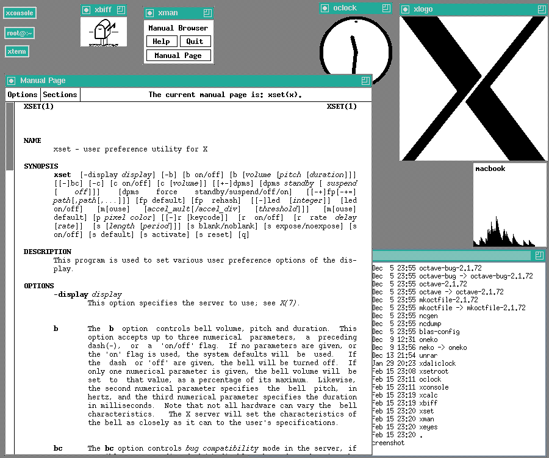

# novo-logo-twitter-plagio-logo-x-window-system
Twitter cometeu plágio ao apresentar seu novo logo que se parece com o logo do X Window System?

O X Window System (também conhecido como X11 ou simplesmente X) é um sistema de exibição de janelas para sistemas operacionais baseados em Unix. Ele foi desenvolvido originalmente no Massachusetts Institute of Technology (MIT) na década de 1980 e é amplamente utilizado em sistemas operacionais como Linux e BSD.

